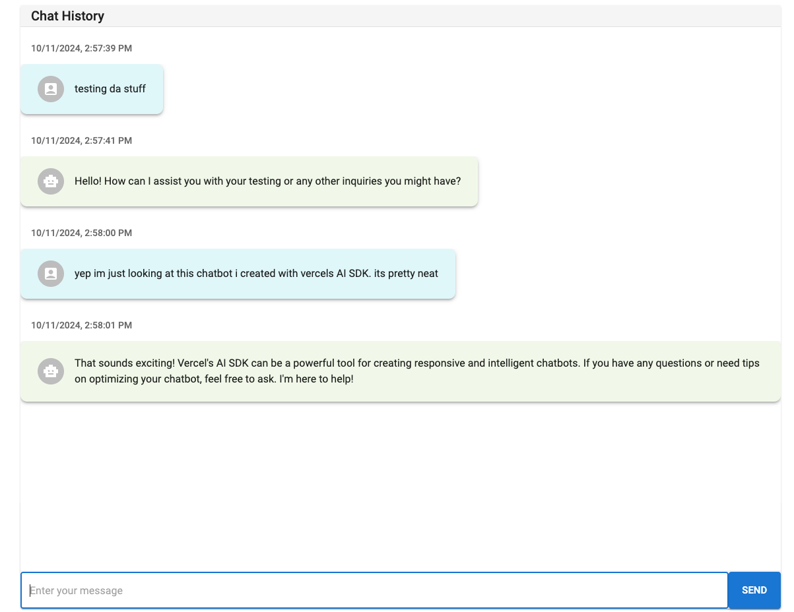

# AI Chatbot with React & Next
Proof of concept for an AI chatbot using React, Next, & Vercel's AI SDK.

## Getting Started

### Set OpenAI Key

Set the ENV variable `OPENAI_KEY` to your OpenAI API key.

Example: `OPENAI_API_KEY=*********************`

### Install Dependencies

```bash
npm install pnpm
pnpm install
```

### Run the Development Server
```bash
pnpm dev
```

Open [http://localhost:3000](http://localhost:3000) with your browser to see the result.

## Example

The app itself is pretty basic. Just a proof of concept:


